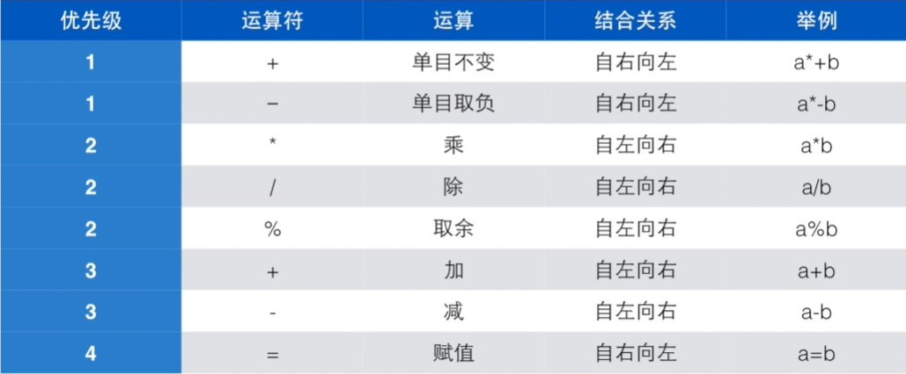
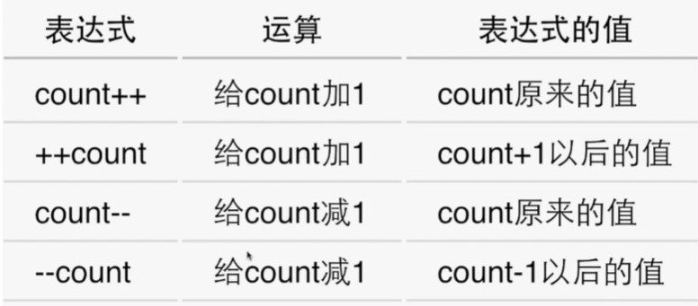
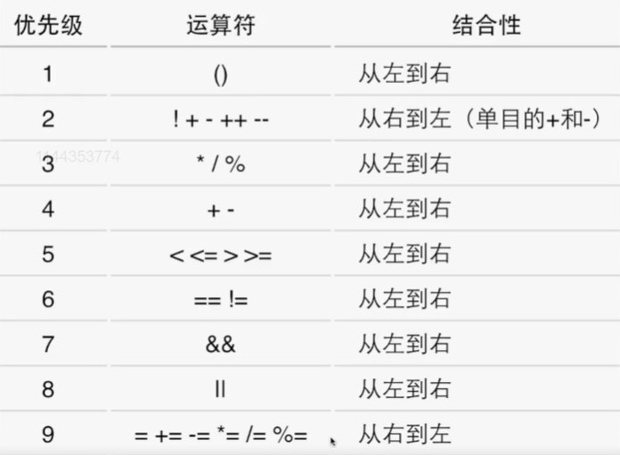

# C语言入门 翁恺

## 01. 程序设计与C语言

### 1.1 计算机和编程语言

#### 1.1.1

1. 程序：程序是计算机能识别和执行的一组命令，即用编程语言写出来的，能够进行编译且顺利运行的代码段
   - 计算机思维——how to do
   - 不是用来和计算机沟通，而是描述要求它如何做事的过程或方法

2. 计算机的语言：16进制——程序——算法

3. 算法：计算机做的所有事情都叫计算，计算的步骤就是算法

Question：计算机里的CPU可以直接运行人类编写的程序吗？为什么说编程语言不是和计算机交谈的语言？

- CPU不能直接运行人类编写的程序，需要编译变成CPU可识别的语言（二进制，十六进制等）才可以运行；

- 因为编程语言并不是在和计算机交谈，他是在一步一步告诉计算机应该如何去做解决问题，编程语言仅仅是下达命令。

#### 1.1.2

1. 计算机思维
   - 解方程——人
   - 枚举——计算机
   - 二分搜索——更快速的程序

2. 程序的执行
   - 解释：借助一个程序，该程序可以理解你的程序，然后按照你的要求执行
   - 编译：借助一个程序（翻译），把你的程序翻译成计算机能懂的机器语言版的程序，直接执行

3. 解释语言vs编译语言
   - 语言本无编译/解释之分
   - 常用执行方式而已：C常编译，python常解释
   - 解释——有特殊计算能力
   - 编译——有确定运算性能

Question：有的编程语言，源代码经过编译后形成目标代码，但是这样的目标代码不能直接在CPU上执行，而是需要由一个仿真器程序来解释执行。这样的执行方式是编译的还是解释的？

- 如果一开始的程序为A，编译后叫B，再在仿真器上解释执行，翻译为C。 
- 从A到B的过程是编译，因为B确实是计算机能直接理解的语言，因为在这样编程体系里，这个仿真器相当于一个“虚拟机”。
- 从B到C的过程里，相当于是解释执行，讲虚拟机的机器语言，翻译成真机的机器语言来执行。

### 1.2 C语言

1. 历史
   - FORTRAN - BCPL - B - C
   - 1969 年出现
   - 1973 年 3 月：第三版 Unix 上出现了 C 语言编译器
   - 1973 年 11 月：第四版 Unix 完全用 C 语言重写

2. 版本
   - 经典 C
   - 1989 ANSI C
   - 1990 ISO 接受了 ANSI 的标准——C89
   - 1995 1999 两次更新：C95 C99
   - 2011 C11

3. 应用
   - 操作系统
   - 嵌入式系统
   - 驱动程序
   - 底层驱动：图形引擎、图像处理、声音效果等

### 1.3 第一个程序

#### 1.3.1

1. 示例：编辑——编译——运行——控制台（终端）看结果

   ```c
   #include <stdio.h>
   
   int main()
   {
       
   	printf("Hello World!\n");
   	
   	return 0;
   }
   ```

2. 程序框架

   ```c
   #include <stdio.h>
   
   int main(){
   	return 0;
   }
   ```

3. 输出

   - 语法：`printf("Hello World!\n");`
   - `""`里为字符串，`printf` 会将字符串原封不动输出
   - `\n` 表示换行，不输出——转义字符

4. 程序中出错
   - 错误行标识
   - 编译出错：有时错误提示行与出错行不同

#### 1.3.2

1. 做计算：

   `printf("%d", 12 + 34);` ——输出为 `46` 

   `printf("12 + 34 = %d", 12 + 34);` ——输出为 `12 + 34 = 46`

2. 四则运算

   | **运算符** | **术语**   | **示例** | **结果** |
   | ---------- | ---------- | -------- | -------- |
   | +          | 正号       | +3       | 3        |
   | -          | 负号       | -3       | -3       |
   | +          | 加         | 10 + 5   | 15       |
   | -          | 减         | 10 - 5   | 5        |
   | *          | 乘         | 10 * 5   | 50       |
   | /          | 除         | 10 / 5   | 2        |
   | %          | 取模(取余) | 10 % 3   | 1        |

3. 找零程序

   ```c
   #include <stdio.h>
   
   int main(){
       int price = 0;
       
       printf("请输入金额（元）：");
       scanf("%d", &price);//这里为什么要用&price？
       
       int change = 100 - price;
       
       printf("找您%d元", change);
       
       return 0;
   }
   ```

Question：GCC 是什么？

​	GCC 的全称是 GNU Compiler Collection，它是一个能够编译多种语言的编译器。最开始 GCC 是作为 C 语言的编译器（GNU C Compiler），现在除了 C 语言，还支持C++、java、Pascal等语言。GCC 还支持多种硬件平台。

https://zhuanlan.zhihu.com/p/76930507

## 02. 计算

### 2.1 变量

#### 2.1.1 变量定义

1. 外部输入
   - 保存输入数据：提前创建一个变量
     - 语法：`int price = 0；` 一般形式：`<变量类型><变量名称1>,<变量名称2>;`
     - 变量定义：保存数据的地方
     - 变量名称：==标识符==，用来识别不同变量或函数
     - 构造规则：字母数字下划线，数字不能在第一个位置上，不能与关键字相同
   - 如何输入数据
     - 语法：`scanf`
   - 输入数据参与计算

### 2.2 数据类型

浮点数和整数放到一起运算时，整数会转换成浮点数。

- double
  - `printf("%f", ...)`
  - `scanf("%lf", ...)`
- `%d` 和 `%u` 都是十进制。`%o` 是八进制，`%x` 是十六进制

### 2.3 表达式

1. 运算符：进行运算的动作

   

2. 算子：参与运算的值
3. 结合关系
   - 一般自左向右
   - 单目+- 和赋值= 自右向左

4. 交换两个变量
   - 程序表达的是顺序**执行的动作**（步骤），而**不是关系**
   - 需要临时中间变量

5. 复合赋值
   - `+=`
   - ``*=` `total *= sum + 12; <==>total = total * (sum+12);`

6. 递增递减运算符前缀后缀

   - `a++` 的值是 a 加 1 以前的值
   - `++a` 的值是加了 1 以后的值
   - 无论哪个，a 自己的值都加了 1 了

   

### 2.4 在线评判系统

## 03 判断与循环

### 3.1 判断

1. 所有的关系运算符的优先级比算术运算的低，但是比赋值运算的高。
2. 判断是否相等和不等的优先级比其他的低，连续的关系运算是从左到右进行的。

### 3.2 循环

1. while语句：`while`

2. do-while语句：`do-while`: `do { <循环体语句> } while (<循环条件>);`

3. for语句：`for (<初始条件> <循环继续的条件> <循环每轮要做的动作>)`
   - `for (i=1; i<n; i++)...`
   - `for (i=n; i>1; i--)...`
   - `for (n=n; n>1; n--)...`
   - `for (; n>1; n--)...`

4. 任何一个 for 循环都可以改成 while 循环

5. Tips for loops
   - 如果有固定次数，用 for
   - 如果必须执行一次，用 do-while
   - 其他情况用 while

## 04 进一步的判断与循环

###  4.1 逻辑类型和运算

1. 没有真正的 bool 类型

2. 逻辑运算符
   - `!`
   - `&&`
   - `||`

3. `!age<20`: 单目运算符优先级高于双目运算符，`(!age)<20`，表达式永远为 0

4. 优先级

   

   - 逻辑运算符优先级普遍低于比较运算符
   - `! > && > ||`: `!done && (count > MAX)`

5. 短路：逻辑运算是自左向右进行的，如果左边的结果已经能够决定结果了，就不会做右边的运算。
   - 对于 `&&`，左边的是 false 时就不做右边了
   - 对于 `||`，左边的是 true 时就不做右边了

6. 条件运算符
   - `count = (count>20) ? coutn-10:count+10`
   - 条件、满足时的值、不满足时的值
   - 优先级高于赋值运算符，但是低于其他运算符
   - 自右向左结合

7. 逗号
   - 用来连接两个表达式，并以其右边的表达式的值作为它的结果。
   - 优先级是所有的运算符中最低的。
   - `(3+4, 5+6)` 的结果是 11
   - 在 for 中使用：`for (i=0,j=10; i<j; i++,j—)…`

### 4.2 级联和嵌套的判断

1. else 的匹配：总是和最近的 if 匹配（不加大括号的时候）。

2. tips：
   - 在 if 或 else 后面总是用 `{}`
   - 即使只有一条语句的时候。
   - 级联：`if, else if`

### 4.3 多路分支

1. switch-case
   - `switch (控制表达式) { case 常量: 语句; break;}`
   - `break` 让程序离开那个 `case`。如果没有 break 直接进到下一个 case。case 只是一个入口。

### 4.4 循环的例子

1. 小套路
   - 将会变化的量保存下来，如果后面需要的话。
   - 如果要模拟运行一个很大次数的循环，可以模拟较少的循环次数，然后作出推断。

2. 整数的分解
   - `%10` 个位数
   - `/10` 丢掉个位数
   - 再 `%10` 得到十位数

3. 逆序

   ```c
   # include <stdio.h>
   
   int main()
   {
       int x;
       x = 12345;
       int digit;
       int ret = 0;
       
       while (x > 0) {
           digit = x%10;
           // 如果要输出类似 007 需要
           printf("%d", digit);
           ret = ret*10 + digit;
           print("x=%d, digit=%d, ret=%d\n", x, digit, ret);
           x /= 10;
       }
       printf("%d", ret);
       return 0;
   }
   ```

4. 

### 4.5 判断和循环常见的错误

1. 忘了大括号
2. if 后面的分号
3. 错误使用 == 和 =
4. 代码风格

## 05 循环控制

### 5.1 循环控制

1. `break` : 跳出循环

- `continue` : 跳过循环这一轮剩下的语句进入下一轮

### 5.2 多重循环

1. 嵌套循环

2. 凑硬币：接力 `break` or `goto`

   ```c
   int x;
   int one, two, five;
   int exit = 0;
   
   scanf("%d", &x);
   for ( one = 1; one < x*10; one++) {
       for (two = 1; two < x*10/2, two++) {
           for (five = 1; five < x*10/5; five++) {
               if (one + two*2 + five*5 == x*10) {
                   printf("可以用%d个1角加%d个2角加%d个五角得到%d元\n",
                         one, two, five, x);
                   exit = 1;
                   break;
               }
           }
           if (exit == 1) break;
       }
       if (exit == 1) break;
   }
   ```

   ```c
   int x;
   int one, two, five;
   int exit = 0;
   
   scanf("%d", &x);
   for ( one = 1; one < x*10; one++) {
       for (two = 1; two < x*10/2, two++) {
           for (five = 1; five < x*10/5; five++) {
               if (one + two*2 + five*5 == x*10) {
                   printf("可以用%d个1角加%d个2角加%d个五角得到%d元\n",
                         one, two, five, x);
                   goto out;
               }
           }
       }
   }
   out:
   	return 0;
   ```

### 5.3 循环应用

1. 求和

   ```c
   double sum = 0.0;
   double sign = 1.0;
   for (i = 1; i <= n; i++) {
       sum += sign/i;
       sign = - sign;
   }
   ```

2. 求最大公约数

   - 枚举

     ```c
     int ret = 0;
     for (i = 1; i < min(a,b); i++) {
         if (a%i == 0) {
             if (b%i == 0) {
                 ret = i;
             }
         }
     }
     ```

   - 辗转相除法

     ```
     while (b != 0) {
         t = a%b;
         a = b;
         b = t;
     }
     ```

     - 如果 b 等于 0，计算结束，a 就是最大公约数
     - 否则，计算 a%b，让 a 等于 b，而 b 等于那个余数
     - 回到第一步

3. 正序分解整数

   ```c
   int x;
   scanf("%d", &x);
   int mask = 1;
   int t = x;
   while (t > 9) {
       t /= 10;
       mask *= 10;
   }
   do {
       int d = x/mask;
       if (mask > 9) {
           printf(" ");
       }
       x %= mask;
       mask /= 10;
   } while (mask > 0);
   
   // x = 13425; need 1 3 4 2 5
   // 13425 / 10000 -> 1
   // 13425 % 10000 -> 3425
   // 10000 / 10 -> 1000;
   // 3425 / 1000 -> 3;
   // 3425 % 1000 -> 425;
   // 1000 / 10 -> 100;
   // 425 / 100 -> 4;
   // 425 % 100 -> 25;
   // 100 / 10 -> 10
   // 25 / 10 -> 2
   // 25 % 10 -> 5
   // 10 / 10 -> 1
   // 5 / 1 -> 5
   // 5 % 1 -> 0
   // 0 / 10 -> 0
   ```

## 06 数组与函数

### 6.1 数组

1. 数组是长度固定的数据结构，用来存放指定的类型的数据。一个数组里可以有很多个数据，所有的数据的类型都是相同的。
   - 定义：`<类型> 变量名称 [元素数量];` `int number[100];`
   - 赋值：`number[i] = x;`

2. 数组是一种容器，特点：
   - 所有元素具有相同数据类型；
   - 一旦创建，不能改变大小；
   - 数组中的单元依次排列。

3. 编译器和运行环境都不会检查数组下标是否越界。
   - 读数时就计数
   - 数组大小作为变量

### 6.2 函数的定义与使用

1. “代码复制” 是程序质量不良的表现。

2. 函数是一块代码，接收零个或多个参数，做一件事情，并返回零个或一个值。

```
返回类型 函数名 (参数表)` `void sum(int begin, int end) {}
```

3. void 不能使用带值的 return

### 6.3 函数的参数和变量

1. 原型声明：将函数头放在调用前。函数头参数可以不写名字。如果确定没有参数，把 void 写进去：`void swap(void);` 对于不返回值而且只有一个 int 类型的参数的函数，以下函数原型是正确的：
   - `void f(int x);`
   - `void f();`
   - `void f(int);`

2. 函数参数表中的参数：形式参数 VS 实际参数：调用函数时给的值。（已经不需要这么认识了）。

3. 定义在函数内部的变量就是本地变量（局部变量）。
   - 本地变量的生存期、作用域：大括号内。
   - 块外定义的变量，块内仍然有效。
   - 内部外部同名，内部会覆盖掉外部。
   - 本地变量不会被默认初始化。
   - 参数在进入函数的时候就初始化了。

4. C 语言不允许函数嵌套定义，但是可以放声明。

5. 关于 main 函数，return 0 有意义的，return 非 0：
   - windows: if errorlevel 1…
   - Unix Bash: echo $?
   - Csh: echo $status

### 6.4 二维数组

1. 二维数组的初始化：
   - 列数必须给出，行数可以由编译器来数；
   - 每行一个 `{}`，逗号分隔；
   - 最后的逗号可以存在；
   - 如果省略，表示补零；

## 07. 数组运算

### 7.1 数组运算

1. 数组集成初始化：
   - `int a[] = {2, 4, 6, ...};`，大小由元素数量确定。
   - `int a[13] = {2};`，除了第一个元素为 2，其他元素均为 0
   - `int a[10] = { [0] = 2, [2] = 3, 6, };` 6 是 `a[3]`
     - 用 `[n]` 在初始化数据中给出定位
     - 没有定位的数据接在前面的位置后面
     - 其他位置的值补零
     - 也可以不给出数组大小，让编译器算
     - 特别适合初始数据稀疏的数组

2. 数组大小：
   - `sizeof(a)/sizeof(a[0])`

3. 数组赋值：
   - `int a[] = {2,3,4}; int b[] = a;` 是不能赋值的
   - 必须遍历：`for (i=0; i<length; i++) {b[i] = a[i];}``
   - ``int a[][3] = { {0},{1},{2} };`，`a = [[0,0,0],[1,0,0],[2,0,0]]`

4. 遍历数组：
   - 通常使用 for，i 从 0 到 < 数组的长度

5. 数组作为函数参数时，往往**必须再用另一个参数来传入数组大小**：
   - 不能在 `[]` 中给出数组大小
   - 不能再利用 sizeof 来计算数组的元素个数

6. 求素数（待补充）：
   - 之前是依次从 2 开始遍历到 x-1
   - 偶数肯定不是素数，所以只遍历奇数
   - 偶数肯定不是素数，只遍历小于 sqrt(x) 的奇数
   - 遍历比 x 小的素数
   - 构造素数表：假设所有数字都是素数，剔除每个数字的倍数，最后剩下的就是素数

### 7.2 搜索

1. 基本方法：遍历
   - 单一出口
   - 一个变量承担多个职能是不好的代码

2. 美元对应：
   - 分别是两个数组，找到要的金额的位置，就可以在名字数组中同样的位置找到对应的名字。这种程序对 cache 不友好。
   - 希望金额和名字在一起。重新定义一种数据结构。

3. 线性搜索（遍历）没有效率。假设所有的数据是排好序的：

   - 给定要搜索的数字，先找到中间的数字，去掉一半的数字；重复。

   ```c
   // 二分搜索 log2(N)
   int search(int key, int a[], int len)
   {
       int ret = -1;
       int left = 0;
       int right = len-1;
       while( right > left )
       {
           int mid = (left+right)/2;
           if ( a[mid] == k)
           {
               ret = mid;
               break;
           }
           else if (a [mid] > k)
           {
               right = mid-1;
           }
           else
           {
               left = mid+1;
           }
       }
       return ret;
   }
   ```

### 7.3 排序初步

## 08. 指针与字符串

### 8.1 指针

1. `sizeof` 给出某个类型或变量在内存中占的字节数

2. `&` : `"%p"`，取地址（16 进制）
   - 获得变量的地址，它的操作数必须是变量
   - 地址的大小是否与 int 相同取决于编译器
   - 不能对没有地址的取地址
   - 连续两个变量，地址紧挨，中间相差**变量类型**占得字节，先定义的在更低的位置（堆栈，自顶向下）
   - 数组：`&a==a==&a[0]==&a[1]-类型长度`

3. 指针：就是保存地址的变量
   - `int *p` 表示`*p` 是一个 int，p 是一个指针
   - 作为参数：`void f(int *p)`，在被调用时得到了某个变量的地址：`int i=0; f(&i);`，在函数里面可以通过这个指针访问外面的这个 i，经过 f 函数的调用后 i 的值变了。
   - 访问地址上的变量：`*`是一个单目运算符，用来访问指针的值所表示的地址上的变量，可以做右值也可以做左值：`int k = *p; *p = k+1;`

4. 指针与数组：
   - 函数参数表中的数组实际上是指针，参数中的 `int a[]` 是指针
     - `sizeof(a) == sizeof(int*)`
     - 但是可以用数组的运算符 `[]` 进行运算
     - `int sum(int *ar, int n) == int sum(int *, int) == int sum(int ar[], int n) == int sum(int [], int)` 在参数表中是等价的
     - 所以在函数内部没有办法用 sizeof 获取大小
   - 数组变量是特殊的指针
     - 数组变量本身表达地址，因此 `int a[10]; int *p = a; //无需用 & 取地址`，但是数组的单元表达的是变量，需要用 `&` 取地址：`a==&a[0];`
     - `[]`运算符可以对数组做，也可以对指针做：`p[0] == a[0]`
     - `*` 运算符可以对指针做，也可以对数组做：`*a = 25`
     - 数组变量是 const 的指针，所有不能被赋值：`int a[] == int *const a=`

### 8.2 字符类型

1. char 是一种**整数**，也是一种特殊的类型：**字符**。

   - 单引号表示字符变量

   - `printf scanf` 中用 `%c` 输入输出字符

   - `'1'` 的 ASCII 编码是 49，所以当 c==49 时，它代表 `'1'`

   - 如何输入 `'1'` 这个字符给 char c

     - `scanf("%c", &c); ->1`

     - `scanf("%d", &i); c=i; ->49`

     - ‘1’ 的 ASCII 编码是 49，所以当 c==49 时，它代表 ‘1’，**49==’1’**

     - 一个 49 各自表述

     - 混合输入

       - 没有空格，只读到**整数结束**为止

       - `scanf("%d %c", &i, &c);` 与 `scanf("%d%c", &i, &c);`

     - 字符计算

       - `'A++' == 'B'`
       - 大小写转换：`a+'a'-'A'` 可以把一个大写字母变成小写字母；`a+'A'-'a'`可以把小写字母变成大写字母

   - 逃逸字符

     - 用来表达无法打印出来的控制字符或特殊字符，由一个反斜杠开头
     - `\b, \t, \n, \r, \", \', \\`，table 是在固定位置（制表位），`\r` 是回车，编译器会把 `\n`翻译成回车+换行

### 8.3 字符串

1. 字符数组如 `char word[] = {'H', 'e', 'l', 'l'}` 不是 C 语言的字符串，因为不能用字符串的方式做计算，这样的才是：`char word[] = {'H', 'e', 'l', 'l', '\0'}`，word 还是字符数组，但是因为最后的 0，它就是 C 语言的字符串，可以使用字符串运算方法运算。

2. 字符串是以 0（整数0）结尾的一串字符（一定要有 0），**0 或 `'\0'`** 是一样的，但是和 `'0'` 不同

3. 0 标志字符串的阶数，但不是字符串的一部分，计算长度不包含这个 0

4. 字符串以**数组的形式**存在，以**数组或指针的形式访问**，我们可以用指针访问一个数组，也可以用数组的形式去访问指针所代表的那一片连续的地址空间（但字符串在内存当中的表达形式一定是数组）。更多是以指针的形式。

5. `string.h` 里有很多处理字符串的函数
6. 字符串变量：
   - `char *str = "Hello";`
   - ``char word[] = "Hello";`
   - `char line[10] = "Hello";`

7. 字符串常量：
   - “Hello”，会被编译器变成一个字符数组放到某处，这个数组的长度是 6，结尾还有表示结束的 0

8. **总结：C 语言的字符串是以字符数组的形式存在的**
   - 不能用运算符对字符串做运算
   - 通过数组的方式可以遍历字符串
   - 唯一**特殊**的地方是字符串字面量可以用来初始化字符数组以及**标准库**提供了一系列字符串函数

9. `char *s = "Hello, World!";`